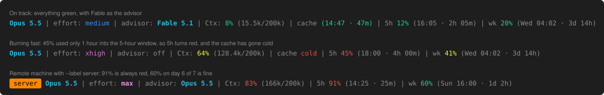

# claude-statusline

A status line for [Claude Code](https://code.claude.com/docs/en/statusline) that shows your model, effort level, [advisor](https://code.claude.com/docs/en/advisor), context usage, when the [prompt cache](https://code.claude.com/docs/en/prompt-caching) goes cold, and your 5-hour and weekly usage limits.

The usage limits are colored by **pace**, not just by how high the number is. They turn red when you're on track to run out before the limit resets. 60% used on the last day of the week is fine, but 45% on the first day is not.



Already using it? Paste the [update prompt](#update) into Claude Code to get the latest version.

## Install

Paste this into Claude Code:

```text
Install the status line from https://github.com/TheDyXer/claude-statusline for me:

1. Pick the script for this machine. If Python 3 is available (python3, or python / py on Windows), use statusline.py. Otherwise, on Windows, use statusline.ps1.
   https://raw.githubusercontent.com/TheDyXer/claude-statusline/main/statusline.py
   https://raw.githubusercontent.com/TheDyXer/claude-statusline/main/statusline.ps1
2. Download it into my Claude config folder (~/.claude, which is %USERPROFILE%\.claude on Windows). Read it before saving: it should only read JSON from stdin, this session's transcript and Claude Code's settings files, and print one line.
3. Back up ~/.claude/settings.json, then set only its "statusLine" key and keep everything else:
   "statusLine": { "type": "command", "command": "<command>", "refreshInterval": 30 }
   Use absolute paths with forward slashes in <command>:
   - Python: <full path to python> <full path to>/statusline.py
   - PowerShell: pwsh -NoProfile -ExecutionPolicy Bypass -File <full path to>/statusline.ps1
     (use powershell instead of pwsh if PowerShell 7 isn't installed)
4. Badge label: none
   (If this says a name instead of "none", add --label NAME for Python or -Label NAME for PowerShell to the end of the command.)
5. Test the command by piping in {"model":{"display_name":"Opus"},"context_window":{"used_percentage":12,"total_input_tokens":24000,"context_window_size":200000}}
   It should print "Opus | advisor: none selected | Ctx: 12% (24k/200k)" with color codes. If I have an advisor set, it shows that model instead of "none selected". Show me the result.
```

The status line appears after your next message. To show a badge, for example to tell a remote server apart from your own computer, change `Badge label: none` to a name before pasting.

<details>
<summary>Install by hand instead</summary>

**macOS / Linux**

```sh
curl -fsSL https://raw.githubusercontent.com/TheDyXer/claude-statusline/main/statusline.py -o ~/.claude/statusline.py
```

Then add this to `~/.claude/settings.json`:

```json
"statusLine": {
  "type": "command",
  "command": "python3 ~/.claude/statusline.py",
  "refreshInterval": 30
}
```

**Windows**

```powershell
Invoke-WebRequest https://raw.githubusercontent.com/TheDyXer/claude-statusline/main/statusline.ps1 -OutFile "$HOME\.claude\statusline.ps1"
```

Then add this to `%USERPROFILE%\.claude\settings.json`, with your user name in the path:

```json
"statusLine": {
  "type": "command",
  "command": "pwsh -NoProfile -ExecutionPolicy Bypass -File C:/Users/YOU/.claude/statusline.ps1",
  "refreshInterval": 30
}
```

Use `powershell` instead of `pwsh` if you only have Windows PowerShell 5.1. If you have Python on Windows, you can use `statusline.py` instead. It starts faster.

</details>

## Update

Paste this into Claude Code to get the latest version:

```text
Update my Claude Code status line from https://github.com/TheDyXer/claude-statusline:

1. Read the "statusLine" command in my ~/.claude/settings.json (%USERPROFILE%\.claude on Windows). Note which script it runs (statusline.py or statusline.ps1) and any --label / -Label. If it runs neither, stop and tell me to use the install prompt instead.
2. Download the latest version of that same script:
   https://raw.githubusercontent.com/TheDyXer/claude-statusline/main/statusline.py
   https://raw.githubusercontent.com/TheDyXer/claude-statusline/main/statusline.ps1
   Read it before saving: it should only read JSON from stdin, this session's transcript and Claude Code's settings files, and print one line.
3. Compare it with my current copy. If they're identical, tell me it's already up to date and stop. Otherwise, summarize what changed in a few lines. If my copy has edits that look like my own customizations rather than an older version, list them and ask me before continuing.
4. Back up my current script next to it as <name>.bak, then replace it. Don't change settings.json.
5. Run the command from settings.json with {"model":{"display_name":"Opus"},"context_window":{"used_percentage":12,"total_input_tokens":24000,"context_window_size":200000}} piped in, and show me the result.
```

Your settings and badge label stay as they are. If you've edited the script yourself, the prompt asks before replacing your edits, and the old copy is kept as a `.bak` file.

## What it shows

| Part | Example | Color |
|---|---|---|
| Badge (optional) | `server` | black on orange, only with `--label` / `-Label` |
| Model | `Opus 5.5` | bold cyan |
| Effort level | `effort: high` | `low` plain, `medium` blue, `high` bright blue, `xhigh` magenta, `max` bold bright magenta |
| Advisor | `advisor: Fable 5.1` or `advisor: none selected` | model in bold cyan, `none selected` in yellow |
| Context window | `Ctx: 8% (15.5k/200k)` | green below 50%, yellow 50–79%, red 80% and up |
| Prompt cache | `cache (14:32 · 47m)` or `cache cold` | green, yellow in the last 20% of the cache's lifetime, `cold` in red |
| 5-hour limit | `5h 62% (16:05 · 2h 05m)` | by pace (see below) |
| Weekly limit | `wk 41% (Wed 04:02 · 3d 14h)` | by pace (see below) |

Reset and expiry times are in your local time, followed by a countdown. Once a reset time has passed, the countdown is left off.

Parts with no data are hidden and don't leave a placeholder. The usage limits only appear on Pro and Max plans, after the first reply in a session. The effort level only appears for models that support it. The cache part appears after the first reply, and is hidden if your provider doesn't report caching.

### The cache part

It shows when the session's prompt cache goes cold, and how long that is from now. Once it's cold, your next message re-processes the whole conversation instead of reading it from the cache, which uses more of your limits or costs more. The cache's lifetime is 1 hour or 5 minutes. A 5-minute cache is yellow only in its last minute, so with the 30-second refresh you'll see yellow for a refresh or two. The switch to `cold` happens right on time, because Claude Code redraws the status line the moment a warm cache expires.

### The advisor part

The advisor part is always shown, and each session shows its own advisor. If you run `/advisor opus` in one session and `/advisor fable` in another, each line says what that session uses.

Claude Code doesn't send the advisor to status line scripts, and `settings.json` only holds the last choice saved from any session. So the script reads it from two places:

1. **This session's transcript** (the file in `transcript_path`, last 2 MB). Every reply records the advisor it was sent with, and nothing when there's none. `/advisor` also writes a message there right away, so a change shows up before the next reply. This covers `claude --advisor` sessions too, from the first reply on.
2. **The settings files**, when the transcript doesn't say yet: a new session before its first reply, or right after `/clear`. These are checked in the same order Claude Code uses:
   1. `.claude/settings.local.json` in the project
   2. `.claude/settings.json` in the project
   3. `~/.claude/settings.json`, or the folder in `CLAUDE_CONFIG_DIR`

The line catches up within 30 seconds of a change. A short name like `fable` shows as `Fable`, and a full model ID like `claude-opus-5-5` shows as `Opus 5.5`.

It shows `none selected` in yellow when the session's replies go out without an advisor, or when nothing sets one. That includes picking an advisor the main model can't use, since the replies then go out without it. When `CLAUDE_CODE_DISABLE_ADVISOR_TOOL` is set in the environment the status line runs in, advisors are turned off entirely and it shows a gray `off`.

Sometimes `/advisor` saves a new choice but says the current conversation keeps its old advisor, or runs without one, until `/clear` or `/compact`. The line then shows what the conversation actually uses.

The transcript format and the `/advisor` messages come from Claude Code 2.1.288. If a later version changes them, the script falls back to the settings files, and the tests (`tests/test_parity.py`) show what broke.

## How pace colors work

The script estimates where you'll end up at reset if you keep going at your current rate. That's the percent used divided by how much of the window has passed.

| Projected at reset | Color |
|---|---|
| below 80% | green |
| 80–100% | yellow |
| over 100% (you'll run out before the reset) | red |

For example, 41% used halfway through the week projects to 82%, so it's yellow.

Two exceptions:

- 90% or more used is always red, because you're about to hit the limit either way.
- In the first 10% of a window (30 minutes of the 5-hour window, about 17 hours of the week), the estimate jumps around too much. So it uses the same thresholds as the context window instead.

## Requirements

- Claude Code with status line support. The usage limits need v2.1.251 or later.
- Python 3 (tested with 3.12 and 3.14), or Windows PowerShell 5.1 or PowerShell 7 (tested with 5.1 and 7.6).
- A terminal with 256 colors, for the badge. Everything else uses basic ANSI colors.

`refreshInterval: 30` redraws the line every 30 seconds, so the countdowns stay current while Claude Code is idle. Each run takes well under a second.

## Customizing

The thresholds are in `raw_color` and `pace_color` in `statusline.py`, and in `Get-RawColor` and `Get-PaceColor` in `statusline.ps1`. The two scripts are meant to print exactly the same thing. If you change both, run the tests:

```sh
python tests/test_parity.py --show
```

This feeds 114 sample inputs to both scripts, at a fixed test time, with test settings files and session transcripts for the advisor part. It checks that the output matches byte for byte, and that the colors are the expected ones. It uses `pwsh` if it's installed, or Windows PowerShell otherwise. Set `PS_EXE` to choose. Without PowerShell, it runs only the Python checks.

## License

[MIT](LICENSE). This is not affiliated with Anthropic.
